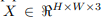
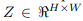
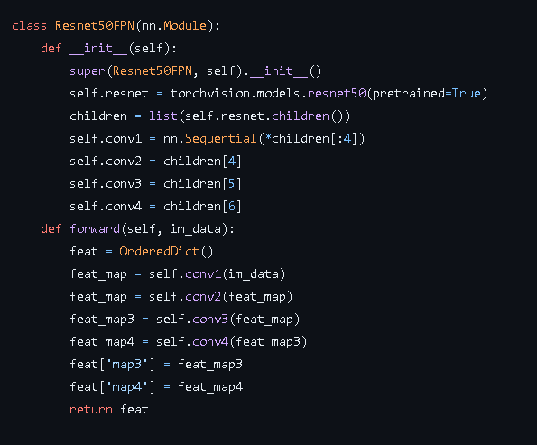
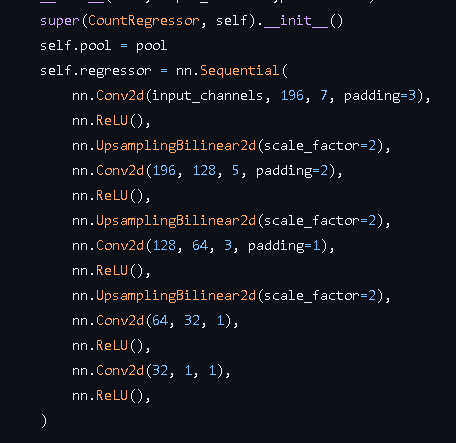
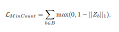
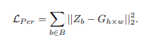
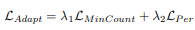
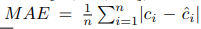
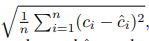

Learning To Count Everything 
## 1. Chọn bài báo
- Link paper: <https://arxiv.org/pdf/2104.08391.pdf> 
- Link code: <https://github.com/cvlab-stonybrook/LearningToCountEverything>  
- Link tìm kiếm: <https://openaccess.thecvf.com/menu> 
## 2. Nội dung
### a. Giới thiệu
- Các phương pháp hiện tại để thực hiện việc đếm đối tượng trong ảnh tập trung chủ yếu vào một loại đối tượng duy nhất như là con người, động vật hoặc các tế bào. Trong bài báo này, nhóm nghiên cứu mong muốn đếm mọi thứ, tức là đếm được bất cứ vật thể nào chỉ một vài trường hợp được dán nhãn từ nhóm vật thể đó.
- Có hai thách thức chính mà cộng đồng Thị giác máy tính đang gặp phải khi thiết kế hệ thống có khả năng đếm một số lượng lớn các visual categories. Thách thức đầu tiên là các phương pháp đếm hiện đại yêu cầu một lượng lớn hình ảnh đã được gán nhãn để huấn luyện. Điều này đặc biệt khó khăn khi muốn đếm từng đối tượng từ nhiều danh mục hình ảnh khác nhau. Do đó, việc xây dựng tập dữ liệu đếm có đủ kích thước và đa dạng để huấn luyện các model đếm tổng quát là một thách thức lớn. Thách thức thứ hai là thiếu các tập dữ liệu đếm không ràng buộc đủ lớn với nhiều danh mục hình ảnh để phát triển các phương pháp đếm tổng quát. Hầu hết các bộ dữ liệu phổ biến đều chỉ có một loại đối tượng duy nhất. 
- Để giải quyết hai thách thức trên, bài báo đã đề xuất một phương pháp few-shot regression. Bài báo đề xuất kiến trúc mới gọi là Few Shot Adaptation and Matching Network (FamNet) và sử dụng tập dữ liệu FSC-147.
### b. Dữ liệu
Có 2 bộ dữ liệu được sử dụng:

- FSC-147 Dataset: 
  + Tập dữ liệu này bao gồm 6135 hình ảnh từ 147 danh mục đối tượng khác nhau (từ đồ dùng nhà bếp và văn phòng phẩm cho đến xe cộ và động vật). Các hình ảnh trong tập dữ liệu được gán nhãn bằng hai loại chú thích: dot và bounding box, và phù hợp để phát triển các mô hình đếm theo kiểu few-shot.
  + [Một số hình ảnh phân tích dữ liệu]

  + Thu thập data: bắt đầu với danh sách các loại đối tượng và thu thập 300–3000 ảnh ứng viên cho mỗi loại từ việc scrape web, thực hiện kiểm tra thủ công để lọc ra những hình ảnh không đáp ứng điều kiện:
    - Chất lượng hình ảnh cao: Độ phân giải phải đủ cao để dễ dàng phân biệt giữa các đối tượng.
    - Số lượng đối tượng đủ lớn: Số lượng đối tượng ít nhất là 7, vì con người không cần sự giúp đỡ khi đếm một số lượng nhỏ đối tượng.
    - Sự tương đồng về ngoại hình: chọn các hình ảnh có các đối tượng với các tư thế, cấu trúc và ngoại hình hơi giống nhau.
    - Không có che phủ nặng: loại bỏ các hình ảnh có đối tượng bị che phủ nặng mà con người không thể đếm chính xác số lượng.
  + Gán nhãn: Với mỗi hình ảnh chọn ngẫu nhiên 3 đối tượng làm ví dụ mẫu và vẽ các bounding box cho những trường hợp đó. Các đối tượng còn lại sẽ được đánh dấu bằng một dấu chấm (dot annotation) ngay tâm của vật thể. Nếu bị che lấp, vật thể sẽ được tính là một thực thể nếu tỉ lệ che phủ ít hơn 90%
  + Chia train/test: Số lượng ảnh trên các tập Train, Val, Test lần lượt là 3659, 1286 và 1190 hình ảnh.
    - COCO (Val và Test): Tập dữ liệu này gồm có 277 hình ảnh thuộc Val-COCO và 282 hình ảnh thuộc Test-COCO
### c. Few Shot Adaptation và Matching Network (FamNet) - Kiến trúc

- Kiến trúc này bao gồm hai thành phần chính: mô-đun trích xuất đặc trưng và mô-đun dự đoán mật độ.
  + input:  Mạng nhận một hình ảnh    và một số bounding boxes của exemplars đại diện cho đối tượng cần đếm từ cùng một hình ảnh. (Một ảnh chứa các vật thể mà ta muốn đếm, một vài bounding box xung quanh các vật thể mà ta quan tâm)
  + output: Mạng tạo ra Density map dự đoán (density map)  và số lượng đối tượng quan tâm được tính bằng tổng tất cả các giá trị mật độ.
- Mô-đun trích xuất đặc trưng:

  + Ảnh đầu vào và các vật thể ví dụ sẽ đi qua lớp trích xuất đặc trưng
  + Mô-đun này được sử dụng để trích xuất thông tin từ hình ảnh và tạo ra các feature map.
  + Sử dụng 1 mạng ImageNet pretrained để trích xuất đặc trưng, cụ thể là sử dụng kết quả từ 4 khối đầu tiên của mô hình ResNet-50 để học các biểu diễn đặc trưng của hình ảnh.
  + Mô-đun này trích xuất ra các đặc trưng có liên quan tới vật thể và ảnh đầu vào.
- ROI Pooling:
  + Input: feature map và 3 bounding box 
  + Output: feature map với độ lớn được khóa lại cho từng cái vật thể
  + Thực hiện ROI pooling trên các feature map tích chập từ khối thứ ba và thứ tư của ResNet-50 để tập trung vào các thông tin quan trọng từ vùng quan tâm của hình ảnh và tạo ra các đặc trưng đa tầng
- Correlation layer:
  + Đầu vào của mô-đun dự đoán mật độ không phải là đầu ra từ module trích xuất đặc trưng mà nhóm nghiên cứu sẽ sử dụng một correlation map (bản đồ tương quan) giữa các đối tượng đặc trưng mẫu (exemplar features) và các đặc trưng của hình ảnh để làm đầu vào cho mô-đun dự đoán mật độ
  + FamNet tính toán ra một bản đồ tương quan giữa các đặc trưng được trích xuất từ các vật thể ví dụ và toàn bộ hình ảnh, bản đồ tương quan này sẽ đánh dấu các khu vực trong ảnh gần giống với các vật thể ví dụ
  + Input: Đặc trưng đa tầng của exemplar và bản đồ đặc trưng của ảnh.
  + Output: Bản đồ tương quan giữa exemplar và ảnh.
- Mô-đun dự đoán mật độ:

  + Input: bản đồ tương quan giữa đặc trưng của exemplar và đặc trưng của hình ảnh làm đầu vào
  + Output: Density map 2D dự đoán số lượng đối tượng quan tâm trong ảnh
  + Mô-đun này được thiết kế để dự đoán mật độ đối tượng trong hình ảnh truy vấn.
  + Mô-đun dự đoán mật độ sử dụng một mạng học sâu, chẳng hạn như mạng Convolutional Neural Network (CNN), để tạo ra một Density map cho các đối tượng quan tâm trong hình ảnh truy vấn.
  + Density map này cho biết mức độ tập trung của các đối tượng trong hình ảnh, mỗi pixel trên bản đồ mật độ thể hiện tỉ lệ vị trí đó tồn tại vật thể mà ta quan tâm	
## 3. Chạy lại thí nghiệm
### a. Huấn luyện
- Trong bài báo, tác giả đã mô tả quá trình huấn luyện mô hình FamNet sử dụng các hình ảnh trong tập dữ liệu FSC-147. Mối hình ảnh huấn luyện chứa nhiều đối tượng quan tâm, nhưng chỉ các đối tượng mẫu được chú thích bằng bounding box và đa số các đối tượng chỉ có chú thích dạng điểm. Tuy nhiên, việc huấn luyện một mạng ước lượng mật độ dựa trên chú thích dạng điểm trực tiếp là vô cùng khó khăn. Các phương pháp hiện có cho việc đếm hình ảnh thường áp dụng tích chập(convolution) của bản đồ chú thích dạng điểm với một cửa sổ Gaussian có kích thước cố định, thường là 15x15, để tạo ra Density map mục tiêu được làm mờ để huấn luyện mạng ước lượng mật độ.
- Tập dữ liệu bao gồm 147 danh mục khác nhau, trong đó có sự biến đổi lớn về kích thước của các đối tượng. Để tạo ra Density map mục tiêu, nhóm đã sử dụng phương pháp làm mịn Gaussian với kích thước cửa sổ thích ứng. Đầu tiên sử dụng chú thích dạng điểm để ước lượng kích thước của các đối tượng. Dựa trên bản đồ chú thích dạng điểm, trong đó mỗi điểm nằm ở trung tâm xấp xỉ của một đối tượng, tính khoảng cách giữa mỗi điểm và điểm láng giềng gần nhất, và tính trung bình của các khoảng cách này cho tất cả các điểm trong hình ảnh. Khoảng cách trung bình này được sử dụng làm kích thước cửa sổ Gaussian để tạo ra Density map mục tiêu. Độ lệch chuẩn của Gaussian được đặt thành một phần tư kích thước cửa sổ.
- Để huấn luyện FamNet, tác giả đã tối thiểu hoá sai số bình phương trung bình giữa Density map dự đoán và Density map thực tế. Trong bài báo sử dụng bộ tối ưu hoá Adam với learning rate 10-5 , batch size 1. Thay đổi kích thước hình ảnh để có chiều cao cố định là 384 và chiều rộng được điều chỉnh tương ứng để giữ tỉ lệ ảnh ban đầu.
### b. Test-time adaptation:
- Min-Count Loss: Hàm mất mát này đảm bảo tổng giá trị mật độ trong mỗi bounding box của vật thể ví dụ đạt giá trị ít nhất là một. Điều này xảy ra vì số lượng vật thể được dự đoán được tính bằng tổng các giá trị mật độ dự đoán, dẫn đến việc phải có ít nhất một đối tượng trong tại vị trí mà bounding box chỉ định. Tuy nhiên, do sự chồng chéo có thể xảy ra giữa bounding box và các đối tượng gần đó, tổng giá trị mật độ ở các vị trí mà ta quan tâm có thể lớn hơn một. Min-Count Loss đo lường sự vi phạm ràng buộc này bằng cách tính sự khác biệt giữa một và tổng các giá trị mật độ trong bounding box.

  

- Perturbation Loss: Hàm mất mát này sử dụng thông tin về vị trí được cung cấp bởi các bounding box quanh các vật thể ví dụ. Nó được lấy cảm hứng từ các thuật toán theo dõi dựa trên bộ lọc tương quan. Density map Z được xem như một bản đồ phản hồi tương quan giữa các ví dụ và hình ảnh. Các giá trị mật độ xung quanh vị trí của một ảnh ví dụ sẽ mang hình dạng tương tự như một phân phối Gaussian. Perturbation Loss đo lường sự khác biệt giữa các giá trị mật độ thực tế và một cửa sổ Gaussian 2D cùng kích thước.

  

- Adaptation loss cuối cùng là tổ hợp có trọng số của Min-Count Loss và Perturbation Loss. Trọng số được xác định bởi các siêu tham số scalar λ1 và λ2. Hàm mất mát điều chỉnh được sử dụng trong quá trình thử nghiệm, trong đó tối ưu hóa gradient descent được thực hiện cho mỗi hình ảnh thử nghiệm. Learning Rate, số bước gradient, λ1 và λ2 được điều chỉnh dựa trên hiệu suất trên tập xác nhận.
  

  + Trong bài báo sử dụng learning rate 10-7, λ1 và λ2 lần lượt là 10-9 và 10-4

- Adaptation loss chỉ được sử dụng trong quá trình kiểm tra. Trong quá trình huấn luyện FamNet, Adaptation loss không được sử dụng vì hàm mất mát huấn luyện dựa trên sai số trung bình bình phương cung cấp cho mô hình tín hiệu giám sát mạnh hơn. Tuy nhiên, điều quan trọng cần đảm bảo là các hàm mất mát và gradient của chúng có cùng độ lớn để đảm bảo quá trình điều chỉnh giá trị của các siêu tham số diễn ra trong khoảng giá trị hợp lý trong quá trình huấn luyện.
- Few-shot adaptation:
  + Để thích ứng mạng với danh mục hình ảnh mới trong quá trình kiểm tra, FamNet sử dụng phương pháp thích ứng few-shot.
  + Trong quá trình thích ứng, một số đối tượng ví dụ từ danh mục mới được sử dụng để cập nhật mô-đun trích xuất đặc trưng và mô-đun dự đoán mật độ.
  + Các đối tượng ví dụ này giúp mạng học được thông tin về đặc trưng và mật độ của các đối tượng trong danh mục mới.
  + Quá trình thích ứng few-shot giúp cải thiện hiệu suất của FamNet trong việc đếm các đối tượng từ danh mục mới.
### c. Phương pháp đánh giá
- Mean Absolute Error (MAE): 
- Root Mean Squared Error (RMSE)
### d. Kết quả
- Kết quả với tập val và test của bộ dataset FSC-147

<table><tr><th colspan="1" rowspan="2" valign="top">

Phương pháp
</th><th colspan="2" valign="top">Val set</th><th colspan="2" valign="top">Test set</th></tr>
<tr><td colspan="1" valign="top">MAE</td><td colspan="1" valign="top">RMSE</td><td colspan="1" valign="top">MAE</td><td colspan="1" valign="top">RMSE</td></tr>
<tr><td colspan="1" valign="top">Mean </td><td colspan="1" valign="top">53.38 </td><td colspan="1" valign="top">124.53</td><td colspan="1" valign="top">47.55</td><td colspan="1" valign="top">147.67</td></tr>
<tr><td colspan="1" valign="top">Median </td><td colspan="1" valign="top">48.68</td><td colspan="1" valign="top">129.70</td><td colspan="1" valign="top">47.73</td><td colspan="1" valign="top">152.46</td></tr>
<tr><td colspan="1" valign="top">FR few-shot detector</td><td colspan="1" valign="top">45.45</td><td colspan="1" valign="top">112.53</td><td colspan="1" valign="top">41.64</td><td colspan="1" valign="top">14.04</td></tr>
<tr><td colspan="1" valign="top">FSOD few-shot detector</td><td colspan="1" valign="top">36.36</td><td colspan="1" valign="top">115.00</td><td colspan="1" valign="top">32.53</td><td colspan="1" valign="top">140.65</td></tr>
<tr><td colspan="1" valign="top">Pre-trained GMN</td><td colspan="1" valign="top">60\.56</td><td colspan="1" valign="top">137.78</td><td colspan="1" valign="top">62.69</td><td colspan="1" valign="top">159.67</td></tr>
<tr><td colspan="1" valign="top">GMN</td><td colspan="1" valign="top">29.66</td><td colspan="1" valign="top">89.81</td><td colspan="1" valign="top">26.52</td><td colspan="1" valign="top">124.57</td></tr>
<tr><td colspan="1" valign="top">MAML</td><td colspan="1" valign="top">25.54</td><td colspan="1" valign="top">79.44</td><td colspan="1" valign="top">24.90</td><td colspan="1" valign="top">112.68</td></tr>
<tr><td colspan="1" valign="top">FamNet (Provided)</td><td colspan="1" valign="top">24.23</td><td colspan="1" valign="top">70.81</td><td colspan="1" valign="top">22.54</td><td colspan="1" valign="top">101.27</td></tr>
<tr><td colspan="1" valign="top"><b>FamNet (us)</b></td><td colspan="1" valign="top"><b>24.76</b></td><td colspan="1" valign="top"><b>78.07</b></td><td colspan="1" valign="top"><b>22.46</b></td><td colspan="1" valign="top"><b>106.33</b></td></tr>
</table>

- Kết quả với tập val và test của bộ COCO

<table><tr><th colspan="1" rowspan="2" valign="top">

Phương pháp
</th><th colspan="2" valign="top">Val-COCO Set</th><th colspan="2" valign="top">Test-COCO Set</th></tr>
<tr><td colspan="1" valign="top">MAE</td><td colspan="1" valign="top">RMSE</td><td colspan="1" valign="top">MAE</td><td colspan="1" valign="top">RMSE</td></tr>
<tr><td colspan="1" valign="top">Faster R-CNN </td><td colspan="1" valign="top">52.79 </td><td colspan="1" valign="top">172.46 </td><td colspan="1" valign="top">36.20 </td><td colspan="1" valign="top">79.59</td></tr>
<tr><td colspan="1" valign="top">RetinaNet</td><td colspan="1" valign="top">63.57 </td><td colspan="1" valign="top">174.36 </td><td colspan="1" valign="top">52.67 </td><td colspan="1" valign="top">85.86</td></tr>
<tr><td colspan="1" valign="top">Mask R-CNN</td><td colspan="1" valign="top">52.51 </td><td colspan="1" valign="top">172.21 </td><td colspan="1" valign="top">35.56 </td><td colspan="1" valign="top">80.00</td></tr>
<tr><td colspan="1" valign="top">FamNet (Provided)</td><td colspan="1" valign="top">40.98</td><td colspan="1" valign="top">112.65 </td><td colspan="1" valign="top">23.17 </td><td colspan="1" valign="top">46.55</td></tr>
<tr><td colspan="1" valign="top"><b>FamNet (us)</b></td><td colspan="1" valign="top"><b>43.92</b></td><td colspan="1" valign="top"><b>129.07</b></td><td colspan="1" valign="top"><b>25.89</b></td><td colspan="1" valign="top"><b>55.34</b></td></tr>
</table>

## 4. Phân tích, đánh giá kết quả
### a. Ưu điểm của pp
- FamNet chủ trương giải quyết vấn đề đếm với một lượng nhỏ dữ liệu đào tạo và tỏ ra hiệu quả và vượt trội trong việc này so với nhiều phương pháp trước đó
- Nhờ vào việc sử dụng ước lượng mật độ của các vật thể thay vì sử dụng phương pháp phát hiện xong rồi đếm, mô hình FamNet (cùng với mô hình GMN huấn luyện trên bộ dữ liệu của tác giả, mô hình MAML) đều cho ra kết quả tốt hơn so với các mô hình khác với bài toán đếm số lượng vật thể (khi ta so sánh các phương pháp Few-shot với nhau)
- Module dự đoán mật độ của FamNet được thiết kế để làm việc tốt với các đối tượng có tỷ lệ kích thước khác nhau, giúp cải thiện khả năng dự đoán đối tượng ở nhiều quy mô. 3 thành phần quan trọng làm nên thành công của mô hình FamNet là multi-scale image feature map (feature map của ảnh với nhiều độ lớn khác nhau), multi-scale exemplar features (các đặc trưng ví dụ với nhiều độ lớn khác nhau) và test time adaption (điều chỉnh vào lúc thử nghiệm). Thiếu một trong 3 thành phần này, mô hình khó có thể đạt được kết quả tốt như vậy
- Phương pháp đào tạo của FamNet không yêu cầu đạo hàm bậc cao (higher order gradients) tại thời điểm đào tạo, giúp tăng tốc quá trình huấn luyện
### b. Khuyết điểm của pp
- FamNet yêu cầu người dùng cung cấp các ví dụ từ hình ảnh khi thực hiện đánh giá
- FamNet được xây dựng theo thiên hướng tổng quát, tức là đếm được các đối tượng chung với một vài hình ảnh gợi ý. Thế nên, việc mô hình không đạt được kết quả cao khi được yêu cầu chỉ đếm một loại vật thể nhất định là chuyện không tránh khỏi
- FamNet cũng gặp vấn đề phân biệt giữa tiền cảnh và hậu cảnh, khiến cho việc đếm các vật thể có thiên hướng trùng với hậu cảnh gặp nhiều sai sót [HƯỚNG CẢI TIẾN Ở ĐÂY, XEM COI CÓ PHƯƠNG PHÁP NÀO ĐỂ LOẠI BỎ LỖI NÀY KHÔNG]
### c. Kết luận, hương hướng cải tiến
- Chọn các đối tượng xuất hiện nhiều lần trong ảnh để làm đối tượng đếm chính. Bằng cách sử dụng mạng RepRPN để xác định những đối tượng này dựa trên "repetition score" (điểm lặp), giúp giảm độ phức tạp tính toán và tạo ra một mô hình đếm hiệu quả hơn. Các đối tượng được chọn này sau đó được sử dụng để dự đoán mật độ và thực hiện quá trình đếm trong hình ảnh. (<https://openaccess.thecvf.com/content/ACCV2022/html/Ranjan_Exemplar_Free_Class_Agnostic_Counting_ACCV_2022_paper.html>)

  <https://openaccess.thecvf.com/content/CVPR2023/html/Xu_Zero-Shot_Object_Counting_CVPR_2023_paper.html>

  <https://openaccess.thecvf.com/content/CVPR2022/html/Shi_Represent_Compare_and_Learn_A_Similarity-Aware_Framework_for_Class-Agnostic_Counting_CVPR_2022_paper.html>
## 5. Fine-tuning trên tập dữ liệu mới

